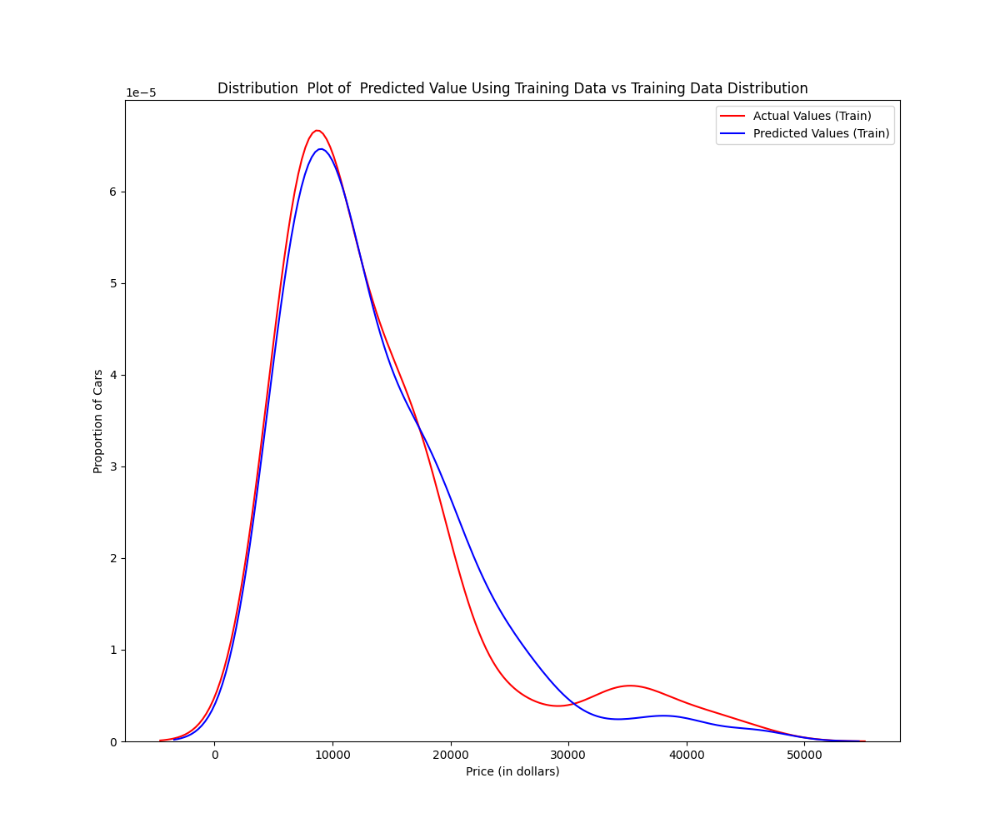
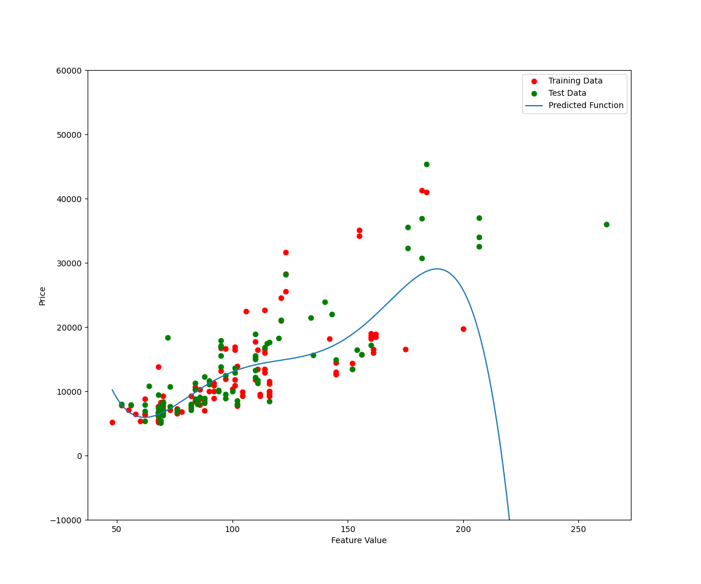
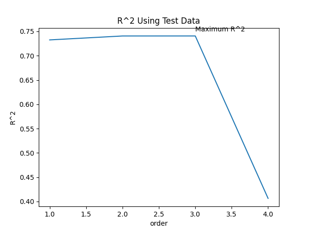

<!DOCTYPE html>
<html lang="en">
<head>
    <meta charset="UTF-8">

</head>

<body>

<h1>Automotive Price Prediction with Linear, Polynomial, and Ridge Regression</h1>

This project demonstrates a workflow for predicting car prices using various regression techniques. It covers data acquisition, exploration, feature engineering, and model training/evaluation (Linear, Polynomial, and Ridge Regression) using the <code>scikit-learn</code> library. The code also highlights best practices in data handling and visualisation.

<h2>Table of Contents</h2>
<ol>
    <li><a href="#overview">Overview</a></li>
    <li><a href="#data-acquisition">Data Acquisition</a></li>
    <li><a href="#data-preparation">Data Preparation</a></li>
    <li><a href="#modelling-visualisations">Modelling &amp; Visualisations</a></li>
    <li><a href="#usage">Usage</a></li>
    <li><a href="#dependencies">Dependencies</a></li>
    <li><a href="#contributing">Contributing</a></li>
    <li><a href="#licence">Licence</a></li>
</ol>

<h2 id="overview">1. Overview</h2>

The dataset includes features such as:

<ul>
    <li><strong>Horsepower</strong></li>
    <li><strong>Curb-weight</strong></li>
    <li><strong>Engine-size</strong></li>
    <li><strong>Highway-mpg</strong></li>
    <li><strong>Normalised-losses</strong></li>
    <li><strong>Symboling</strong></li>
</ul>

By following this project, you will learn how to:

<ul>
    <li>Automate file downloads using <code>requests</code></li>
    <li>Prepare and filter data for machine learning</li>
    <li>Train, validate, and compare different regression models</li>
    <li>Optimise models using <code>GridSearchCV</code></li>
    <li>Visualise model performance and residuals</li>
</ul>

<h2 id="data-acquisition">2. Data Acquisition</h2>

The script downloads the automotive dataset from a public URL:

<pre><code>url = 'https://cf-courses-data.s3.us.cloud-object-storage.appdomain.cloud/IBMDeveloperSkillsNetwork-DA0101EN-SkillsNetwork/labs/Data%20files/module_5_auto.csv'
response = requests.get(url)

if response.status_code == 200:
    with open('module_5_auto.csv', 'wb') as file:
        file.write(response.content)
    print("File downloaded and saved as 'module_5_auto.csv'")
else:
    print(f"Failed to download the file. Status code: {response.status_code}")
</code></pre>

This ensures the required data is automatically fetched before you perform any analyses.

<h2 id="data-preparation">3. Data Preparation</h2>
<ol>
    <li>
        <strong>Load and Inspect</strong>
        <pre><code>df = pd.read_csv('module_5_auto.csv')
print(df.head())</code></pre>
    </li>
    <li>
        <strong>Filter Numeric Columns</strong>
        <pre><code>df = df._get_numeric_data()</code></pre>
    </li>
    <li>
        <strong>Drop Unnecessary Columns</strong>
        <pre><code>df.drop(['Unnamed: 0.1', 'Unnamed: 0'], axis=1, inplace=True)</code></pre>
    </li>
    <li>
        <strong>Split Features and Target</strong>
        <pre><code>y_data = df['price']
x_data = df.drop('price', axis=1)</code></pre>
    </li>
    <li>
        <strong>Train/Test Split</strong>
        <pre><code>x_train, x_test, y_train, y_test = train_test_split(
    x_data, y_data, test_size=0.40, random_state=1
)</code></pre>
    </li>
</ol>

<h2 id="modelling-visualisations">4. Modelling &amp; Visualisations</h2>

<h3>Linear Regression</h3>
<ul>
    <li>Trained with a single feature (<code>horsepower</code>) and multiple features (<code>horsepower</code>, <code>curb-weight</code>, <code>engine-size</code>, <code>highway-mpg</code>).</li>
    <li>Evaluated via <strong>R²</strong> scores and cross-validation (<code>cross_val_score</code>, <code>cross_val_predict</code>).</li>
</ul>

<h3>Polynomial Regression</h3>
<ul>
    <li>Used <code>PolynomialFeatures</code> to create higher-order feature combinations.</li>
    <li>Tested polynomial degrees from 1 to 5.</li>
    <li>Visualised using a custom plotting function <code>PollyPlot</code> to show the polynomial fit versus training and test data.</li>
</ul>

<h3>Ridge Regression</h3>
<ul>
    <li>Introduced a regularisation parameter <code>alpha</code> to prevent overfitting.</li>
    <li>Tuned hyperparameters via <code>GridSearchCV</code>.</li>
    <li>Compared performance by plotting R² scores against different alpha values.</li>
</ul>

<h4>Visualisations</h4>

Below are placeholders for some key visualisations generated by the code. You can save your plots (e.g. via <code>plt.savefig('filename.png')</code>) and embed them here.

    <h5>Distribution Plot (Actual vs Predicted)</h5>
    <!-- Replace 'distribution_plot.png' with your actual plot file -->
    
    
Placeholder for DistributionPlot output.

    <h5>Polynomial Fit Plot</h5>
    <!-- Replace 'polynomial_plot.png' with your actual plot file -->
    
    
Placeholder for PollyPlot output.

    <h5>Alpha vs R² (Ridge Regression)</h5>
    <!-- Replace 'alpha_vs_r2.png' with your actual plot file -->
    
    
Placeholder for R² vs Alpha plot.

<h2 id="usage">5. Usage</h2>
<ol>
    <li><strong>Clone the Repository</strong>
        <pre><code>git clone https://github.com/yourusername/automotive-price-prediction.git
cd automotive-price-prediction
</code></pre>
    </li>
    <li><strong>Install Dependencies</strong>
        <pre><code>pip install -r requirements.txt</code></pre>
    </li>
    <li><strong>Run the Script</strong>
        <ul>
            <li>Python script:
                <pre><code>python your_script_name.py</code></pre>
            </li>
            <li>Jupyter Notebook:
                <pre><code>jupyter notebook</code></pre>
                Then open the <code>.ipynb</code> file and run cells sequentially.
            </li>
        </ul>
    </li>
    <li><strong>Examine Outputs</strong>
        <ul>
            <li>Console/log for R² scores and cross-validation results.</li>
            <li>Plots for distribution, polynomial fits, etc., opened in separate windows or inline in Jupyter.</li>
        </ul>
    </li>
</ol>

<h2 id="dependencies">6. Dependencies</h2>

Required libraries:

<ul>
    <li><code>pandas</code></li>
    <li><code>numpy</code></li>
    <li><code>matplotlib</code></li>
    <li><code>seaborn</code></li>
    <li><code>requests</code></li>
    <li><code>ipywidgets</code></li>
    <li><code>scikit-learn</code></li>
    <li><code>tqdm</code> (optional, for progress bars)</li>
</ul>

Install them via:

<pre><code>pip install pandas numpy matplotlib seaborn requests ipywidgets scikit-learn tqdm</code></pre>

<h2 id="contributing">7. Contributing</h2>

Contributions are welcome. Please open issues for suggestions or submit pull requests for bug fixes and enhancements.

</body>
</html>
